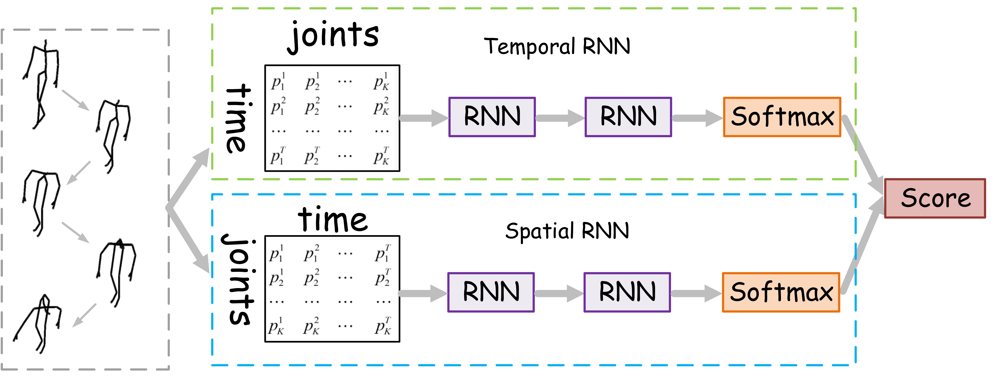
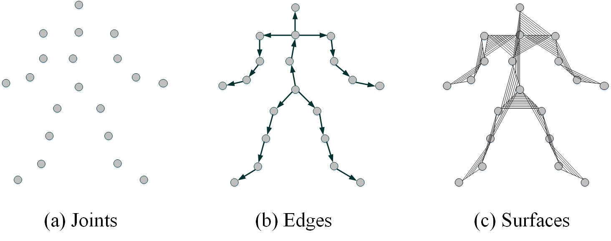
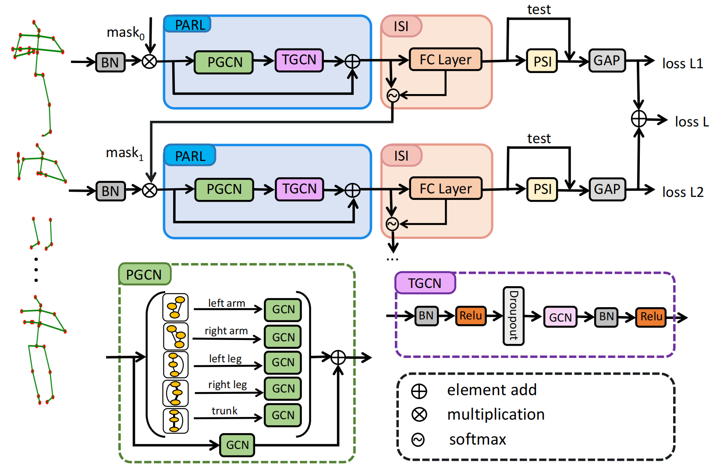
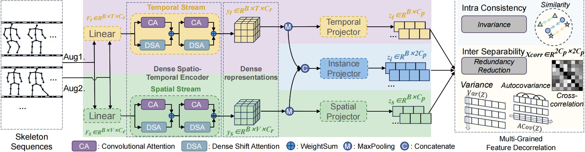

#  Awesome Skeleton-Based Human Action Recognition/Understanding
Representive papers of our groups for skeleton-based human action understanding

# [Modeling Temporal Dynamics and Spatial Configurations of Actions Using Two-Stream Recurrent Neural Networks](https://github.com/hongsong-wang/skeleton_action_awesome/blob/main/Modeling%20Temporal%20Dynamics%20and%20Spatial%20Configurations%20of%20Actions%20Using%20Two-Stream%20Recurrent%20Neural%20Networks.pdf), CVPR, 2017
This is the first two-stream framework for modeling human temporal dynamics and spatial configurations. The proposed two-stream paradigm has been widely adopted in designing networks for skeleton-based human action recognition in this field, e.g., the two-stream Transformer-based networks.


# [Beyond Joints: Learning Representations From Primitive Geometries for Skeleton-Based Action Recognition and Detection](https://github.com/hongsong-wang/skeleton_action_awesome/blob/main/Beyond_Joints_Learning_Representations_From_Primitive_Geometries_for_Skeleton-Based_Action_Recognition_and_Detection.pdf), TIP, 2018
This is the first work on multimodal skeleton-based human action recognition. We design three modalities from skeleton data—joints, edge, and surface—and find that a simple late fusion of these three streams can significantly improve performance. The widely adopted three modalities, namely joint, bone, and motion, are derived from our work. The bone modality corresponds to our edge modality, and the implementation of the bone also just uses our released code, available at [https://github.com/hongsong-wang/Beyond-Joints](https://github.com/hongsong-wang/Beyond-Joints). 


# [Learning content and style: Joint action recognition and person identification from human skeletons](https://github.com/hongsong-wang/skeleton_action_awesome/blob/main/Learning%20content%20and%20style%20Joint%20action%20recognition%20and%20person%20identification%20from%20human%20skeletons.pdf), PR, 2018
This is the first work studies skeleton-based person identification.

# [Occluded Skeleton-Based Human Action Recognition with Dual Inhibition Training](https://github.com/hongsong-wang/skeleton_action_awesome/blob/main/Occluded%20Skeleton-Based%20Human%20Action%20Recognition%20with%20Dual%20Inhibition%20Training.pdf), ACM MM, 2023
This paper addresses occluded and noise-robust skeleton-based action recognition and presents a novel Dual Inhibition Training strategy.


# [USDRL: Unified Skeleton-Based Dense Representation Learning with Multi-Grained Feature Decorrelation](https://github.com/wengwanjiang/USDRL/tree/main), AAAI, 2025
This paper proposes a unified framework for skeleton-based human action understanding, encompassing action recognition, action retrieval, and action detection.


# [Heterogeneous Skeleton-Based Action Representation Learning](https://openaccess.thecvf.com/content/CVPR2025/html/Wang_Heterogeneous_Skeleton-Based_Action_Representation_Learning_CVPR_2025_paper.html), CVPR, 2025
This paper is the first work that studies unified skeleton-based human action recognition from heterogeneous skeletons.


If you find these works useful, please cite them:
```
@inproceedings{wang2017modeling,
  title={Modeling temporal dynamics and spatial configurations of actions using two-stream recurrent neural networks},
  author={Wang, Hongsong and Wang, Liang},
  booktitle={Proceedings of the IEEE conference on computer vision and pattern recognition},
  pages={499--508},
  year={2017}
}

@article{wang2018beyond,
  title={Beyond joints: Learning representations from primitive geometries for skeleton-based action recognition and detection},
  author={Wang, Hongsong and Wang, Liang},
  journal={IEEE Transactions on Image Processing},
  volume={27},
  number={9},
  pages={4382--4394},
  year={2018},
  publisher={IEEE}
}

@article{wang2018learning,
  title={Learning content and style: Joint action recognition and person identification from human skeletons},
  author={Wang, Hongsong and Wang, Liang},
  journal={Pattern Recognition},
  volume={81},
  pages={23--35},
  year={2018},
  publisher={Elsevier}
}

@inproceedings{chen2023occluded,
  title={Occluded skeleton-based human action recognition with dual inhibition training},
  author={Chen, Zhenjie and Wang, Hongsong and Gui, Jie},
  booktitle={Proceedings of the 31st ACM International Conference on Multimedia},
  pages={2625--2634},
  year={2023}
}

@inproceedings{weng2025usdrl,
  title={USDRL: Unified Skeleton-Based Dense Representation Learning with Multi-Grained Feature Decorrelation},
  author={Weng, Wanjiang and Wang, Hongsong and Wang, Junbo and He, Lei and Xie, Guo-Sen},
  booktitle={Proceedings of the AAAI Conference on Artificial Intelligence},
  volume={39},
  number={8},
  pages={8332--8340},
  year={2025}
}

@inproceedings{wang2025heterogeneous,
  title={Heterogeneous Skeleton-Based Action Representation Learning},
  author={Wang, Hongsong and Ma, Xiaoyan and Kuang, Jidong and Gui, Jie},
  booktitle={Proceedings of the Computer Vision and Pattern Recognition Conference},
  pages={19154--19164},
  year={2025}
}

```
